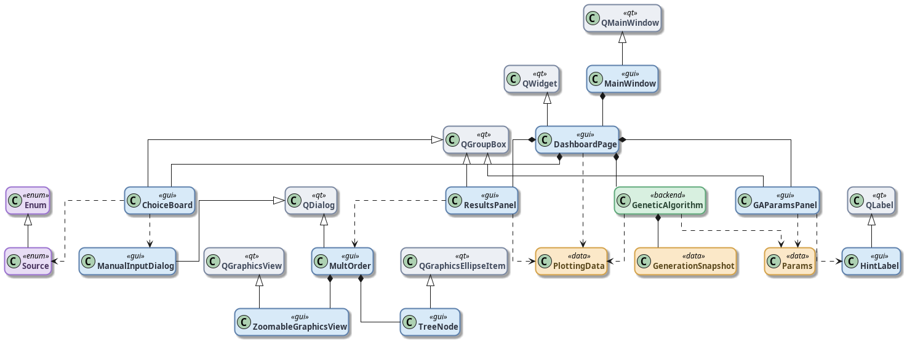
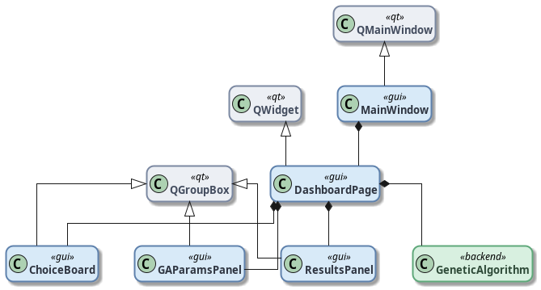
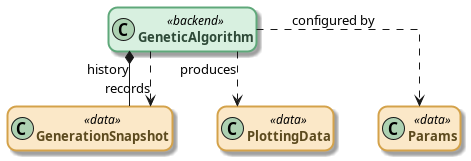
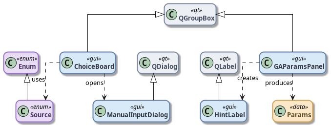
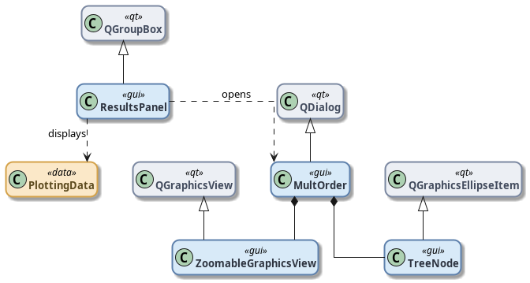
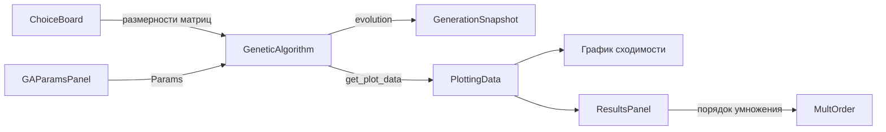

# Генетический алгоритм минимизации числа скалярных умножений при перемножении цепочки матриц

Приложение на **PySide6**, которое ищет оптимальный порядок перемножения цепочки матриц с помощью генетического алгоритма. Результаты визуализируются на графике сходимости и в виде дерева умножения.

## Содержание

- [Задача](#задача)
- [Подход](#подход)
- [Возможности](#возможности)
- [Быстрый старт](#быстрый-старт)
- [Формат входных данных](#формат-входных-данных)
- [Параметры алгоритма](#параметры-алгоритма)
- [Архитектура](#архитектура)
- [Структура проекта](#структура-проекта)

## Задача

Дана цепочка совместимых матриц `A₁ × A₂ × … × Aₙ`. Порядок группировки скобок влияет на число скалярных умножений.

**Пример.** Для размерностей `10 × 30`, `30 × 5`, `5 × 60`:

| Порядок | Стоимость |
|---|---|
| `(A₁ × A₂) × A₃` | `10·30·5 + 10·5·60 = 4 500` |
| `A₁ × (A₂ × A₃)` | `30·5·60 + 10·30·60 = 27 000` |

Задача — найти порядок перемножения с минимальной стоимостью. Точное решение считается динамическим программированием, а генетический алгоритм ищет хорошее приближение за приемлемое время.

## Подход

Каждая особь — последовательность индексов, задающая порядок попарных умножений. На каждом шаге выбираются две соседние матрицы, перемножаются, а цепочка сокращается на одну матрицу.

**Генетический алгоритм:**

1. **Инициализация** — случайная популяция особей.
2. **Оценка** — стоимость = сумма `rows × cols × depth` по всем шагам умножения.
3. **Селекция** — турнирный отбор.
4. **Скрещивание** — одноточечное, с вероятностью `p_c`.
5. **Мутация** — случайная замена гена, с вероятностью `p_m`.
6. **Элитизм** — лучшая особь поколения сохраняется в следующем.

График показывает отношение `target_cost / best_cost` (чем ближе к 1, тем лучше), а также среднее значение поколения, жадную верхнюю оценку и точный минимум.

## Возможности

- Задание матриц тремя способами: случайная генерация, загрузка из файла, ручной ввод.
- Настройка параметров ГА: размер популяции, число поколений, вероятности мутации и скрещивания.
- График динамики сходимости с навигацией по поколениям.
- Интерактивное дерево умножения с масштабированием и прокруткой.

## Быстрый старт

### Требования

- Python 3.10+
- Зависимости из `req.txt`

### Установка

```bash
python -m venv .venv
source .venv/bin/activate
pip install -r req.txt 
```

### Запуск

```bash
python main.py
```

### Генерация тестового файла

```bash
python gen_sample.py
```

Создаёт `matrices.txt` со 100 случайными матрицами (размеры от 5 до 50).

## Формат входных данных

Текстовый файл: по одной матрице на строку, `строки столбцы`:

```
10 30
30 5
5 60
```

Столбцы предыдущей матрицы должны совпадать со строками следующей. Минимум **3 матрицы** для запуска алгоритма.

## Параметры алгоритма

 - Размер популяции - Число особей в поколении 
 - Число поколений - Сколько поколений эволюционировать
 - Вероятность мутации -  Шанс изменения гена у потомка 
 - Вероятность скрещивания -  Шанс скрещивания пары родителей

Для длинных цепочек матриц увеличивайте популяцию и число поколений.

## Архитектура

### Общий обзор



Приложение разделено на GUI-слой (PySide6), backend с генетическим алгоритмом и структуры данных для параметров, истории поколений и графиков.

### Оболочка приложения



`MainWindow` содержит `DashboardPage` — центральный виджет, который объединяет панели ввода, параметров, результатов и движок `GeneticAlgorithm`.

### Backend



`GeneticAlgorithm` конфигурируется через `Params`, на каждом поколении записывает `GenerationSnapshot` в историю и формирует `PlottingData` для визуализации.

### Ввод и конфигурация



- `ChoiceBoard` — выбор источника данных (`Source`: случайные, файл, ручной ввод), открывает `ManualInputDialog`.
- `GAParamsPanel` — настройки ГА с подсказками (`HintLabel`), формирует объект `Params`.

### Результаты и дерево умножения



`ResultsPanel` отображает `PlottingData` и открывает диалог `MultOrder` с интерактивным деревом (`ZoomableGraphicsView` + `TreeNode`).

### Поток данных



## Структура проекта

```
team-work/
├── main.py                          # main файл
├── gen_sample.py                    # Генератор случайного матриц(matrices.txt)
├── req.txt                          # Зависимости
├── icons/icon.png                   # Иконка приложения
├── src/
│   ├── back/
│   │   ├── GA.py                    # Генетический алгоритм
│   │   └── helpers.py               # Вспомогательный(DP, жадный алгоритм, загрузка данных)
│   └── gui/
│       ├── main_window.py           # Главное окно
│       └── pages/
│           ├── dashboard_page.py    # Основная страница с графиком
│           ├── choice_board.py      # Выбор источника матриц
│           ├── param_setter.py      # Параметры ГА
│           ├── results_panel.py     # Панель результатов
│           ├── mult_order.py        # Дерево умножения
│           └── manual_input_dialog.py
└── diagrams/                        # UML-диаграммы архитектуры
    ├── diagram1_application_shell.png
    ├── diagram2_backend.png
    ├── diagram3_input_config.png
    ├── diagram4_results_tree.png
    └── diagram5_full_overview.png
```
